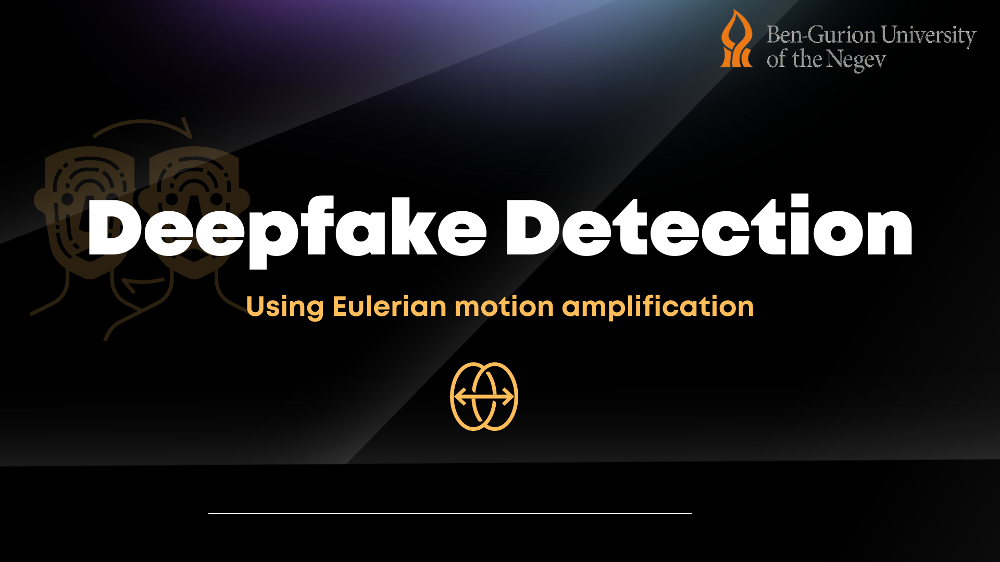

<!-- PROJECT LOGO -->
<br />
<div align="center">
  <a href="https://github.com/rishitsaraf/remoteheartrate_deepfake_detection">
    
  </a>

  <h3 align="center">Deepfake Detection using Euler Video Magnification</h3>

  <p align="center">
    A project as a part of the Data Mining and Cybersecurity for Business Intelligence Summer Programme at the BGU International
    <br />
    <!--<a href="https://github.com/othneildrew/Best-README-Template">View Demo</a> -->
</div>


<!-- TABLE OF CONTENTS -->

  Table of Contents 🗓
  <ol>
    <li>
      <a href="#about-the-project">About The Project</a>
    </li>
    <li>
      <a href="#libraries-used">Libraries Used</a>
    </li>
    <li>
      <a href="#getting-started">Getting Started</a>
      <ul>
        <li><a href="#prerequisites">Prerequisites</a></li>
      </ul>
    </li>
    <li><a href="#roadmap">Roadmap</a></li>
    <li><a href="#contact">Contact</a></li>
    <li><a href="#acknowledgments">Acknowledgments</a></li>
  </ol>


<!-- ABOUT THE PROJECT -->
## About The Project 🚀



This project focuses on developing a video content authenticity detection system.

We are able to determine whether a face in a video is fake or real by  doing a Euler video magnification of the video and then analysing the  frames using the model. 

There are a myriad of possible approaches that can be taken to tackle this problem. The most common ones are: Using CNN to detect Edge/regional anomalies, Identify spacial and temporal inconsistencies, or make the use of the experience of a pre-existing model to classify the video as pristine or fake.

<p align="right">(<a href="#readme-top">back to top</a>)</p>


### Libraries Used

* Numpy
* sys
* dlib
* skimage
* cv2
* math
* matplotlib
* os
* Pandas
* PIL 
* TensorFlow

<p align="right">(<a href="#readme-top">back to top</a>)</p>


<!-- GETTING STARTED -->
## Getting Started 

<ul>
  <li> First run the itercrop on the extracted frames of the video. </li>
  <li> Next run the stich.ipynb to create a stitched video of the cropped facial region from the extraced frames. </li>
  <li> now run the main.py with the recently generated video and get the heartrate of the identified person. </li>
 </ul>

### Prerequisites

The forementioned libraries should be installed in order for the code to run properly. All the libraries can be downloaded to the specified version using the following command:
* npm
  ```sh
  npm install npm@latest -g
  ```
* library
  ```sh
  npm install library_name_here -g
  ```
<p> 👉<a href= "https://sourceforge.net/projects/dclib/files/dlib/v18.10/shape_predictor_68_face_landmarks.dat.bz2/download"> Download this file to run the facial extractor </a> </p>

<!-- ROADMAP -->
## Roadmap 

- [x] Indentify possible datasets
    - [x] Balance the data 
    - [x] Create meta.csv (labels)
- [x] Create a preprocessing pipeleine
    - [x] Extraction of frames from videos
    - [x] Facial indentification and landmark extraction
    - [x] Cropping of face according to the extracted landmarks
    - [x] Stitching of frames to form video ready for EVM
- [x] Created FFT from the ROI to identify frequency for the EVM
- [x] Create an implementation of the <a href = ""> Euler Video Magnification </a>
- [ ] Train a LSTM based classifier to identify if the final processed video is "Pristine" or "Fake".
- [ ] Create an automated pipeline for end to end processing
- [ ] Deploy the model.

<p align="right">(<a href="#readme-top">back to top</a>)</p>


<!-- CONTACT -->
## Contact

Rishit Saraf - [@rishitsaraf](https://twitter.com/rishitsaraf) - rishit@bgu.ac.il <br>
Devansh Pratap Singh - devansh@bgu.ac.il - devanshpratap25@gmail.com

Project Link: [https://github.com/rishitsaraf/remoteheartrate_deepfake_detection](https://github.com/rishitsaraf/remoteheartrate_deepfake_detection)

<p align="right">(<a href="#readme-top">back to top</a>)</p>


<!-- ACKNOWLEDGMENTS -->
## Acknowledgments

Use this space to list resources you find helpful and would like to give credit to. I've included a few of my favorites to kick things off!

* <a href = "https://arxiv.org/pdf/2006.07634.pdf"> DeepRhythm: Exposing DeepFakes with Attentional Visual Heartbeat Rhythms </a>
* <a href = "https://towardsdatascience.com/image-processing-with-python-application-of-fourier-transformation-5a8584dc175b"> Article FFT </a>
* <a href = "https://github.com/flyingzhao/PyEVM"> Python Implementation of EVM </a>
* <a href = "https://people.csail.mit.edu/mrub/evm/"> MIT's orignal implementation of Euler Video Magnification  </a>

<p align="right">(<a href="#readme-top">back to top</a>)</p>
